<div align="center">

<!-- Ultra Modern Animated Header -->


<!-- Matrix Style Typing Effect -->
<a href="https://git.io/typing-svg">
  
</a>

<!-- Neon Glow Badges -->
<p align="center">
  
  
  
  
</p>

<!-- Glowing Separator -->


<!-- Animated Profile Views with Gradient -->
<p align="center">
  
</p>

</div>

<br/>

##  **Code Architect & Digital Craftsman**


```typescript
interface Developer {
  name: string;
  role: string[];
  location: { city: string; state: string; country: string };
  experience: string;
  currentPosition: string;
  
  expertise: {
    frontend: string[];
    backend: string[];
    database: string[];
    tools: string[];
  };
  
  achievements: {
    userEngagement: string;
    performanceBoost: string;
    openSourceStars: string;
    conference: string;
  };
  
  philosophy: string;
  currentFocus: string[];
  dailyRoutine: () => void;
}

const harshad: Developer = {
  name: "HARSHAD JETHVA",
  role: ["Full Stack Developer", "Vibe Coder", "Problem Solver"],
  location: { city: "Amroli", state: "Surat", country: "India 🇮🇳" },
  experience: "2.5+ Years",
  currentPosition: "Store Manager @ Gopani Books",
  
  expertise: {
    frontend: ["React.js", "JavaScript", "HTML5", "CSS3", "Tailwind"],
    backend: ["Python", "PHP", "Node.js"],
    database: ["MongoDB", "MySQL", "SQL"],
    tools: ["GitHub", "Figma", "Canva", "Vercel", "Netlify"]
  },
  
  achievements: {
    userEngagement: "↑30% through innovative frontend",
    performanceBoost: "↓50% load time optimization",
    openSourceStars: "10k+ GitHub stars contribution",
    conference: "Speaker at Regional Web Dev Conference 2026"
  },
  
  philosophy: "Code is poetry, bugs are plot twists! 🎭",
  currentFocus: ["System Design", "Cloud Architecture", "AI Integration"],
  
  dailyRoutine: () => {
    while (alive) {
      code();
      innovate();
      inspire();
      repeat();
    }
  }
};
```

<br clear="right"/>

<!-- Rainbow Divider -->


<br/>

##  **Tech Universe**

<div align="center">

### 🎨 **Frontend Mastery**

<table>
<tr>
<td align="center" width="96">

<br><strong>HTML5</strong>
</td>
<td align="center" width="96">

<br><strong>CSS3</strong>
</td>
<td align="center" width="96">

<br><strong>JavaScript</strong>
</td>
<td align="center" width="96">

<br><strong>React.js</strong>
</td>
<td align="center" width="96">

<br><strong>Tailwind</strong>
</td>
<td align="center" width="96">

<br><strong>Bootstrap</strong>
</td>
</tr>
</table>

### ⚙️ **Backend & Database**

<table>
<tr>
<td align="center" width="96">

<br><strong>Python</strong>
</td>
<td align="center" width="96">

<br><strong>PHP</strong>
</td>
<td align="center" width="96">

<br><strong>Node.js</strong>
</td>
<td align="center" width="96">

<br><strong>MongoDB</strong>
</td>
<td align="center" width="96">

<br><strong>MySQL</strong>
</td>
<td align="center" width="96">

<br><strong>SQL</strong>
</td>
</tr>
</table>

### 🛠️ **DevOps & Tools**

<table>
<tr>
<td align="center" width="96">

<br><strong>Git</strong>
</td>
<td align="center" width="96">

<br><strong>GitHub</strong>
</td>
<td align="center" width="96">

<br><strong>Figma</strong>
</td>
<td align="center" width="96">

<br><strong>VS Code</strong>
</td>
<td align="center" width="96">

<br><strong>Vercel</strong>
</td>
<td align="center" width="96">

<br><strong>Netlify</strong>
</td>
</tr>
</table>

### 🎯 **Currently Exploring**

<p>


</p>

</div>

<br/>

<!-- Rainbow Divider -->


<br/>

##  **GitHub Analytics Dashboard**

<div align="center">

<!-- Main Stats Grid -->


<br/><br/>

<!-- Streak Stats with Custom Theme -->


<br/><br/>

<!-- Activity Graph with Gradient -->


<br/><br/>

<!-- Trophy Showcase -->


</div>

<br/>

<!-- Rainbow Divider -->


<br/>

##  **Professional Journey**

<div align="center">



```mermaid
%%{init: {'theme':'base', 'themeVariables': { 'primaryColor':'#667eea','primaryTextColor':'#fff','primaryBorderColor':'#f093fb','lineColor':'#4facfe','secondaryColor':'#764ba2','tertiaryColor':'#00f2fe'}}}%%
graph LR
    A[🎯 Vision] --> B[💻 Development]
    B --> C[🚀 Innovation]
    C --> D[🌟 Excellence]
    D --> E[🏆 Impact]
    E --> A
    
    B --> F[Frontend<br/>Expertise]
    B --> G[Backend<br/>Skills]
    C --> H[AI<br/>Integration]
    C --> I[Cloud<br/>Architecture]
    D --> J[Performance<br/>Optimization]
    D --> K[Clean<br/>Code]
    E --> L[Community<br/>Contribution]
    E --> M[Mentorship]
    
    style A fill:#667eea,stroke:#f093fb,stroke-width:3px,color:#fff
    style B fill:#764ba2,stroke:#667eea,stroke-width:3px,color:#fff
    style C fill:#f093fb,stroke:#4facfe,stroke-width:3px,color:#fff
    style D fill:#4facfe,stroke:#00f2fe,stroke-width:3px,color:#fff
    style E fill:#00f2fe,stroke:#667eea,stroke-width:3px,color:#fff
```

### 🎯 **Achievement Metrics**

<table>
<tr>
<td align="center" width="25%">

<br/>
<strong>30%</strong>
<br/>
<sub>User Engagement ↑</sub>
</td>
<td align="center" width="25%">

<br/>
<strong>50%</strong>
<br/>
<sub>Performance Boost ↑</sub>
</td>
<td align="center" width="25%">

<br/>
<strong>10K+</strong>
<br/>
<sub>GitHub Stars</sub>
</td>
<td align="center" width="25%">

<br/>
<strong>2026</strong>
<br/>
<sub>Conference Speaker</sub>
</td>
</tr>
</table>

</div>

<br/>

<!-- Rainbow Divider -->


<br/>

##  **Featured Projects Showcase**

<div align="center">

<table>
<tr>
<td width="50%" align="center">

### 🎨 **Portfolio Website**


**Stack:** React • Tailwind • Framer Motion

A stunning showcase featuring smooth animations, modern design principles, and responsive layouts that bring creativity to life.

<a href="https://portfolio-hj.vercel.app/">

</a>

**Highlights:**
- ⚡ Lightning-fast performance
- 🎨 Beautiful UI/UX design
- 📱 Fully responsive
- ✨ Smooth animations

</td>

<td width="50%" align="center">

### 💼 **Enterprise Solutions**


**Stack:** React • Node.js • MongoDB

Building scalable enterprise applications with focus on performance, security, and exceptional user experience.


**Features:**
- 🔐 Advanced security
- 📊 Real-time analytics
- 🚀 High scalability
- 💡 Smart solutions

</td>
</tr>

<tr>
<td width="50%" align="center">

### 🛠️ **Developer Tools**


**Stack:** JavaScript • Web APIs • PWA

Creating productivity tools that make developers' lives easier and more efficient.


**Vision:**
- 🎯 Developer-focused
- ⚙️ Highly customizable
- 🌐 Cross-platform
- 🆓 Open source

</td>

<td width="50%" align="center">

### 🤖 **AI Integration Projects**


**Stack:** Python • TensorFlow • APIs

Exploring AI capabilities to create intelligent solutions for modern problems.


**Focus:**
- 🧠 Machine learning
- 🎯 Smart automation
- 📈 Data analytics
- 🔮 Future tech

</td>
</tr>
</table>

</div>

<br/>

<!-- Rainbow Divider -->


<br/>

##  **Vision & Roadmap 2025**

<div align="center">

### 🎯 **Mission Statement**

> *"To leverage cutting-edge technology in building intuitive, impactful digital solutions that transform ideas into reality. Creating software that's not just technically exceptional, but delivers extraordinary user experiences."*

<br/>

```ascii
╔══════════════════════════════════════════════════════════════╗
║                     2025 GROWTH ROADMAP                      ║
╠══════════════════════════════════════════════════════════════╣
║                                                              ║
║  🎓 Master System Design              [████████░░] 80%      ║
║  🌟 Open Source Leadership            [██████████] 100%     ║
║  💼 Build SaaS Products               [██████░░░░] 60%      ║
║  👥 Mentor 50+ Developers             [███████░░░] 70%      ║
║  🚀 Learn AI/ML Integration           [█████░░░░░] 50%      ║
║  ☁️  Master Cloud Architecture         [████░░░░░░] 40%      ║
║  📱 Launch Mobile Apps                [███░░░░░░░] 30%      ║
║                                                              ║
╚══════════════════════════════════════════════════════════════╝
```

### 📈 **Key Focus Areas**

<table>
<tr>
<td width="33%" align="center">

<h4>🎯 Technical Excellence</h4>
<sub>Continuously evolve skills<br/>Stay cutting-edge<br/>Write clean code</sub>
</td>
<td width="33%" align="center">

<h4>🤝 Community Impact</h4>
<sub>Open source contributions<br/>Mentor developers<br/>Share knowledge</sub>
</td>
<td width="33%" align="center">

<h4>💡 Innovation Drive</h4>
<sub>Explore new tech<br/>Build solutions<br/>Push boundaries</sub>
</td>
</tr>
</table>

</div>

<br/>

<!-- Rainbow Divider -->


<br/>

##  **Let's Connect & Collaborate**

<div align="center">

### 💬 **Always Open To Discuss:**

<p>


</p>

<br/>

### 🌐 **Find Me On**

<a href="https://wa.me/9327128042?text=Hello%20Harshad,%0A%0AI%20found%20your%20GitHub%20profile%20and%20I'm%20interested%20in%20connecting!">
  
</a>
<a href="https://www.linkedin.com/in/harshad-jethva-470745312/">
  
</a>
<a href="https://github.com/Harshad-Jethva">
  
</a>
<a href="mailto:harshadjethva2111@gmail.com">
  
</a>
<a href="https://portfolio-hj.vercel.app/">
  
</a>

<br/><br/>

### 📬 **Reach Out For**

<table>
<tr>
<td align="center" width="20%">
<br/>
<strong>Web Development</strong><br/>
<sub>Full Stack Solutions</sub>
</td>
<td align="center" width="20%">
<br/>
<strong>UI/UX Design</strong><br/>
<sub>Creative Consultation</sub>
</td>
<td align="center" width="20%">
<br/>
<strong>Code Reviews</strong><br/>
<sub>Quality Assurance</sub>
</td>
<td align="center" width="20%">
<br/>
<strong>Mentorship</strong><br/>
<sub>Career Guidance</sub>
</td>
<td align="center" width="20%">
<br/>
<strong>Collaboration</strong><br/>
<sub>Let's Build Together</sub>
</td>
</tr>
</table>

<br/>

### 💌 **Send Me a Message**

<a href="https://wa.me/9327128042?text=Hi%20Harshad!%20I'd%20like%20to%20discuss%20a%20project">
  
</a>
<a href="mailto:harshadjethva2111@gmail.com?subject=Collaboration%20Opportunity">
  
</a>
<a href="https://www.linkedin.com/in/harshad-jethva-470745312/">
  
</a>

</div>

<br/>

<!-- Rainbow Divider -->


<br/>

##  **Activity & Engagement**

<div align="center">

### 📊 **Contribution Heatmap**


<br/><br/>

### 🐍 **Contribution Snake Animation**

<picture>
  <source media="(prefers-color-scheme: dark)" srcset="https://raw.githubusercontent.com/Harshad-Jethva/Harshad-Jethva/output/github-contribution-grid-snake-dark.svg">
  <source media="(prefers-color-scheme: light)" srcset="https://raw.githubusercontent.com/Harshad-Jethva/Harshad-Jethva/output/github-contribution-grid-snake.svg">
  
</picture>

<br/><br/>

### 💭 **Random Dev Quote**


<br/><br/>

### 🎵 **Currently Jamming To**

[](https://spotify-github-profile.kittinanx.com/api/view?uid=31l5bw4ixhf3rnx2evtyb7lmmmqy&redirect=true)

</div>

<br/>

<!-- Rainbow Divider -->


<br/>

##  **Support My Work**

<div align="center">

### ⭐ **
