<div align="center">

<!-- Futuristic Animated Header -->


<!-- Dynamic Typing Animation -->
<a href="https://git.io/typing-svg">
  
</a>

<!-- Holographic Badge Collection -->
<p align="center">
  
  
  
  
  
</p>

<!-- Animated Divider -->


<!-- Profile Views with Glow Effect -->
<p align="center">
  
  
</p>

</div>

<br/>

##  **AI-Native Developer Profile**


```typescript
interface AIAugmentedDeveloper {
  identity: {
    name: string;
    title: string;
    location: string;
    experience: string;
    specialization: string[];
  };
  
  aiToolkit: {
    codingAssistants: string[];
    aiPlatforms: string[];
    productivityAI: string[];
    designAI: string[];
    learningAI: string[];
  };
  
  techStack: {
    frontend: string[];
    backend: string[];
    database: string[];
    cloudPlatform: string[];
  };
  
  achievements: Record<string, string>;
  workflow: () => Promise<void>;
}

const harshad: AIAugmentedDeveloper = {
  identity: {
    name: "HARSHAD JETHVA",
    title: "AI-Powered Full Stack Developer & Vibe Coder",
    location: "Amroli, Surat, India 🇮🇳",
    experience: "2.5+ Years",
    specialization: [
      "AI-Assisted Development",
      "Full Stack Engineering",
      "UI/UX Innovation",
      "Performance Architecture"
    ]
  },
  
  aiToolkit: {
    codingAssistants: [
      "Claude (Anthropic) - Code Architecture",
      "ChatGPT (OpenAI) - Problem Solving", 
      "GitHub Copilot - Code Completion",
      "Cursor AI - Smart IDE",
      "Windsurf - Code Generation",
      "Tabnine - AI Autocomplete",
      "Codeium - Free AI Assistant"
    ],
    aiPlatforms: [
      "Google Gemini - Multi-modal AI",
      "Perplexity AI - Research",
      "Claude.ai - Complex Reasoning",
      "Poe - Multi-model Access",
      "Hugging Face - ML Models"
    ],
    productivityAI: [
      "Notion AI - Documentation",
      "Gamma - AI Presentations", 
      "Grammarly - Writing Assistant",
      "Otter.ai - Meeting Notes",
      "Motion - AI Calendar"
    ],
    designAI: [
      "Midjourney - Image Generation",
      "DALL-E 3 - Creative Assets",
      "Figma AI - Design Assistant",
      "Canva Magic - Quick Designs",
      "Remove.bg - Background Removal"
    ],
    learningAI: [
      "Khan Academy AI - Learning",
      "Coursera AI - Courses",
      "YouTube AI Summaries",
      "Arxiv Sanity - Research Papers"
    ]
  },
  
  techStack: {
    frontend: ["React.js", "JavaScript", "HTML5", "CSS3", "Tailwind CSS"],
    backend: ["Python", "PHP", "Node.js"],
    database: ["MongoDB", "MySQL", "PostgreSQL"],
    cloudPlatform: ["Vercel", "Netlify", "Railway", "Render"]
  },
  
  achievements: {
    engagement: "↑30% User Engagement through AI-powered features",
    performance: "↓50% Load Time with intelligent optimization",
    openSource: "10k+ Stars on GitHub contributions",
    speaking: "Regional Web Dev Conference 2026 Speaker"
  },
  
  workflow: async () => {
    while (true) {
      await ideate.withAI();
      await code.withCopilot();
      await debug.withClaude();
      await design.withMidjourney();
      await optimize.withAIInsights();
      await deploy.withVercel();
      await iterate.continuously();
    }
  }
};

console.log("🚀 Building the future with AI as my co-pilot!");
```

<br clear="right"/>


<br/>

##  **AI Arsenal & Tools**

<div align="center">

### 🤖 **AI Coding Assistants**

<table>
<tr>
<td align="center" width="140">

<br/><strong>Claude AI</strong>
<br/><sub>Code Architecture</sub>
<br/>
</td>
<td align="center" width="140">

<br/><strong>ChatGPT</strong>
<br/><sub>Problem Solving</sub>
<br/>
</td>
<td align="center" width="140">

<br/><strong>Gemini</strong>
<br/><sub>Multi-modal AI</sub>
<br/>
</td>
<td align="center" width="140">

<br/><strong>Copilot</strong>
<br/><sub>Code Completion</sub>
<br/>
</td>
<td align="center" width="140">

<br/><strong>Cursor</strong>
<br/><sub>AI IDE</sub>
<br/>
</td>
</tr>
</table>

### 🌊 **Next-Gen AI Tools**

<table>
<tr>
<td align="center" width="140">

<br/><strong>Windsurf</strong>
<br/><sub>Code Generation</sub>
<br/>
</td>
<td align="center" width="140">

<br/><strong>Antigravity</strong>
<br/><sub>Smart Deployment</sub>
<br/>
</td>
<td align="center" width="140">

<br/><strong>Codeium</strong>
<br/><sub>Free AI Assistant</sub>
<br/>
</td>
<td align="center" width="140">

<br/><strong>Tabnine</strong>
<br/><sub>AI Autocomplete</sub>
<br/>
</td>
<td align="center" width="140">

<br/><strong>Perplexity</strong>
<br/><sub>AI Research</sub>
<br/>
</td>
</tr>
</table>

### 🎨 **AI Design & Creative Tools**

<table>
<tr>
<td align="center" width="140">

<br/><strong>Midjourney</strong>
<br/><sub>Image Generation</sub>
<br/>
</td>
<td align="center" width="140">

<br/><strong>DALL-E 3</strong>
<br/><sub>AI Art</sub>
<br/>
</td>
<td align="center" width="140">

<br/><strong>Figma AI</strong>
<br/><sub>Design Assistant</sub>
<br/>
</td>
<td align="center" width="140">

<br/><strong>Canva Magic</strong>
<br/><sub>Quick Designs</sub>
<br/>
</td>
<td align="center" width="140">

<br/><strong>PS Generative</strong>
<br/><sub>AI Fill</sub>
<br/>
</td>
</tr>
</table>

### 📊 **AI Productivity Suite**

<table>
<tr>
<td align="center" width="140">

<br/><strong>Notion AI</strong>
<br/><sub>Documentation</sub>
<br/>
</td>
<td align="center" width="140">

<br/><strong>Gamma</strong>
<br/><sub>AI Presentations</sub>
<br/>
</td>
<td align="center" width="140">

<br/><strong>Grammarly</strong>
<br/><sub>Writing Assistant</sub>
<br/>
</td>
<td align="center" width="140">

<br/><strong>Otter.ai</strong>
<br/><sub>Meeting Notes</sub>
<br/>
</td>
<td align="center" width="140">

<br/><strong>Motion AI</strong>
<br/><sub>Smart Calendar</sub>
<br/>
</td>
</tr>
</table>

### 🔧 **Traditional Dev Stack**

<p>

</p>

</div>

<br/>


<br/>

##  **AI-Powered Workflow**

<div align="center">



```mermaid
%%{init: {'theme':'base', 'themeVariables': { 'primaryColor':'#8B5CF6','primaryTextColor':'#fff','primaryBorderColor':'#EC4899','lineColor':'#3B82F6','secondaryColor':'#10B981','tertiaryColor':'#F59E0B'}}}%%
graph TB
    A[💡 Ideation] -->|Claude AI| B[📋 Planning]
    B -->|ChatGPT| C[🎨 Design]
    C -->|Midjourney + Figma| D[💻 Development]
    D -->|Cursor + Copilot| E[🧪 Testing]
    E -->|AI Code Review| F[🚀 Deployment]
    F -->|Vercel + Netlify| G[📊 Analytics]
    G -->|Gemini Insights| H[🔄 Iteration]
    H -->|Continuous AI Learning| A
    
    D --> I[Windsurf<br/>Code Gen]
    D --> J[Codeium<br/>Autocomplete]
    D --> K[Tabnine<br/>Smart Complete]
    
    C --> L[DALL-E<br/>Assets]
    C --> M[Canva<br/>Graphics]
    
    B --> N[Notion AI<br/>Docs]
    B --> O[Perplexity<br/>Research]
    
    style A fill:#8B5CF6,stroke:#EC4899,stroke-width:3px,color:#fff
    style D fill:#3B82F6,stroke:#10B981,stroke-width:3px,color:#fff
    style F fill:#10B981,stroke:#F59E0B,stroke-width:3px,color:#fff
    style H fill:#F59E0B,stroke:#8B5CF6,stroke-width:3px,color:#fff
```

### ⚡ **My AI-Enhanced Development Process**

<table>
<tr>
<td width="33%" align="center">

<h4>💭 Ideation Phase</h4>
<sub><b>Tools:</b> Claude, ChatGPT, Perplexity</sub>
<br/><sub>Brainstorm with AI to explore possibilities</sub>
</td>
<td width="33%" align="center">

<h4>⚙️ Development Phase</h4>
<sub><b>Tools:</b> Cursor, Copilot, Windsurf</sub>
<br/><sub>Code faster with AI pair programming</sub>
</td>
<td width="33%" align="center">

<h4>🎯 Optimization Phase</h4>
<sub><b>Tools:</b> Gemini, Claude, AI Analytics</sub>
<br/><sub>Optimize with AI-powered insights</sub>
</td>
</tr>
</table>

</div>

<br/>


<br/>

##  **GitHub Analytics**

<div align="center">


<br/><br/>


<br/><br/>


<br/><br/>


</div>

<br/>


<br/>

##  **Featured AI-Powered Projects**

<div align="center">

<table>
<tr>
<td width="50%" align="center">

### 🌐 **AI-Enhanced Portfolio**


**Built With AI:** Claude for Architecture, Copilot for Code

<a href="https://portfolio-hj.vercel.app/">

</a>

**Stack:** React • Tailwind • AI-Generated Assets

**Features:**
- ⚡ AI-optimized performance
- 🎨 Midjourney-designed graphics
- 🤖 AI-powered interactions
- 📱 Intelligent responsive design

</td>
<td width="50%" align="center">

### 💼 **Smart Enterprise Solutions**


**AI Stack:** Claude, ChatGPT, Gemini, Copilot


**Stack:** React • Node.js • MongoDB • AI APIs

**AI Features:**
- 🧠 Intelligent automation
- 📊 AI analytics dashboard
- 💬 ChatGPT integration
- 🔮 Predictive insights

</td>
</tr>
</table>

</div>

<br/>


<br/>

##  **Vision 2025: AI-First Future**

<div align="center">

### 🎯 **Mission Statement**

> *"Leveraging cutting-edge AI to build intelligent, human-centric digital solutions that transform how we interact with technology. Every line of code is enhanced by AI, every decision informed by data, every product built for the future."*

<br/>

```ascii
╔════════════════════════════════════════════════════════════════╗
║              AI-POWERED GROWTH ROADMAP 2025                    ║
╠════════════════════════════════════════════════════════════════╣
║                                                                ║
║  🤖 Master AI Integration                [████████░░] 80%     ║
║  🧠 Build AI-First Products              [██████░░░░] 60%     ║
║  🌟 Contribute to AI Open Source         [██████████] 100%    ║
║  👥 Train Developers on AI Tools         [███████░░░] 70%     ║
║  ☁️  Master Cloud AI Services             [█████░░░░░] 50%     ║
║  🚀 Launch AI SaaS Platform              [████░░░░░░] 40%     ║
║  📚 Publish AI Development Guide         [██░░░░░░░░] 20%     ║
║                                                                ║
╚════════════════════════════════════════════════════════════════╝
```

### 🎓 **2025 Learning Goals**

<table>
<tr>
<td width="25%" align="center">

<h4>📚 AI/ML Deep Dive</h4>
<sub>TensorFlow • PyTorch • LangChain</sub>
</td>
<td width="25%" align="center">

<h4>☁️ Cloud AI Platforms</h4>
<sub>AWS AI • Google Cloud AI • Azure AI</sub>
</td>
<td width="25%" align="center">

<h4>⚙️ AI Engineering</h4>
<sub>Prompt Engineering • RAG • Fine-tuning</sub>
</td>
<td width="25%" align="center">

<h4>📱 AI Mobile Apps</h4>
<sub>React Native • AI SDKs • Edge AI</sub>
</td>
</tr>
</table>

</div>

<br/>


<br/>

##  **Let's Connect & Build Together**

<div align="center">

### 💬 **Open to Collaborate On:**

<p>


</p>

<br/>

### 🌐 **Find Me Across The Web**

<a href="https://wa.me/9327128042?text=Hi%20Harshad!%20I%20found%20your%20GitHub%20profile%20and%20would%20love%20to%20connect!">
  
</a>
<a href="https://www.linkedin.com/in/harshad-jethva-470745312/">
  
</a>
<a href="https://github.com/Harshad-Jethva">
  
</a>
<a href="mailto:harshadjethva2111@gmail.com">
  
</a>
<a href="https://portfolio-hj.vercel.app/">
  
</a>

<br/><br/>

### 📬 **Collaboration Opportunities**

<table>
<tr>
<td align="center" width="20%">

<br/><strong>Web Development</strong>
<br/><sub>Full Stack with AI</sub>
</td>
<td align="center" width="20%">

<br/><strong>UI/UX Design</strong>
<br/><sub>AI-Enhanced Design</sub>
</td>
<td align="center" width="20%">

<br/><strong>Code Review</strong>
<br/><sub>AI-Assisted QA</sub>
</td>
<td align="center" width="20%">

<br/><strong>Mentorship</strong>
<br/><sub>AI Tools Training</sub>
</td>
<td align="center" width="20%">

<br/><strong>Partnerships</strong>
<br/><sub>Build Together</sub>
</td>
</tr>
</table>

<br/>

### 📊 **Quick Contact**

<a href="https://wa.me/9327128042?text=Hi%20Harshad!%20Let's%20discuss%20an%20AI%20project">
  
</a>
<a href="mailto:harshadjethva2111@gmail.com?subject=AI%20Project%20Collaboration">
  
</a>
<a href="https://www.linkedin.com/in/harshad-jethva-470745312/">
  
</a>

</div>

<br/>


<br/>

##  **Recent Activity**

<div align="center">

### 🐍 **Contribution Snake**

<picture>
  <source media="(prefers-color-scheme: dark)" srcset="https://raw.githubusercontent.com/Harshad-Jethva/Harshad-Jethva/output/github-contribution-grid-snake-dark.svg">
  <source media="(prefers-color-scheme: light)" srcset="https://raw.githubusercontent.com/Harshad-Jethva/Harshad-Jethva/output/github-contribution-grid-snake.svg">
  
</picture>

<br/><br/>

### 💭 **AI-Generated Dev Wisdom**


</div>

<br/>


<br/>

##  **Fun Facts About My AI Journey**

<div align="center">

<table>
<tr>
<td width="50%">

### 🤖 **AI Stats**

```yaml
Total AI Tools Used: 25+
Daily AI Interactions: 100+
Code Generated with AI: 40%
Time Saved by AI: 50%
Bugs Fixed by AI: 200+
Lines Reviewed by AI: 10,000+
AI Models Tested: 15+
Prompts Engineered: 1000+
```

</td>
<td width="50%">

### 💡 **AI Insights**

```yaml
Favorite AI: Claude (for complex reasoning)
Most Used: GitHub Copilot (daily coding)
Best Discovery: Cursor AI (game changer)
Productivity Boost: Notion AI (organization)
Creative Tool: Midjourney (visualizations)
Research Helper: Perplexity AI (deep dives)
Code Quality: AI code reviews (95% accuracy)
Learning Speed: 3x faster with AI tutors
```

</td>
</tr>
</table>

### 🎯 **My AI Philosophy**

> "AI is not here to replace developers—it's here to amplify our creativity, accelerate our productivity, and help us build the impossible. The future belongs to those who master the collaboration between human intuition and artificial intelligence."

<br/>

<p>

<strong>+</strong>

<strong>=</strong>

</p>

</div>

<br/>


<br/>

<div align="center">

### ⭐ **Show Some Love!**

*If this README inspired you, star some repos and follow for more AI-powered innovations!*

<br/>

**🌟 Building tomorrow's solutions with today's AI 🤖**

<br/>


</div>

---

<div align="center">
  <sub>✨ Crafted with 💜 by <strong>HARSHAD JETHVA</strong> | Powered by AI 🤖 | HJ INFOTECH © 2025</sub>
  <br/>
  <sub>🚀 <i>"Code • Create • Innovate with AI"</i></sub>
</div>
