<div align="center">

<!-- Ultra Premium Holographic Header -->


<!-- Holographic Typing Animation -->
<a href="https://git.io/typing-svg">
  
</a>

<!-- Premium Holographic Badges with Gradients -->
<p align="center">
  
  
  
  
  
</p>

<!-- Neon Separator Line -->


<!-- Advanced Metrics Row -->
<p align="center">
  
  
  
</p>

</div>

<br/>

##  **`AI-AUGMENTED DEVELOPER`**


```typescript
// ═══════════════════════════════════════════════════════════════
// 🌌 QUANTUM DEVELOPER PROFILE - HARSHAD JETHVA
// ═══════════════════════════════════════════════════════════════

interface QuantumDeveloper {
  identity: {
    name: string;
    role: string[];
    location: string;
    experience: string;
    email: string;
    portfolio: string;
  };
  
  aiSuperPowers: {
    codingCopilots: Map<string, string>;
    aiPlatforms: Map<string, string>;
    productivityAI: Map<string, string>;
    creativeAI: Map<string, string>;
    cloudAI: Map<string, string>;
  };
  
  techMatrix: {
    frontend: string[];
    backend: string[];
    database: string[];
    deployment: string[];
  };
  
  achievements: {
    userEngagement: number;
    performanceGain: number;
    openSourceImpact: string;
    conference: string;
  };
  
  quantumLoop: () => Promise<void>;
}

const HARSHAD: QuantumDeveloper = {
  identity: {
    name: "HARSHAD JETHVA",
    role: [
      "AI-First Full Stack Developer",
      "Vibe Coder & Digital Architect", 
      "Innovation Engineer"
    ],
    location: "Amroli, Surat, India 🇮🇳",
    experience: "2.5+ Years | ∞ Passion",
    email: "harshadjethva2111@gmail.com",
    portfolio: "https://portfolio-hj.vercel.app"
  },
  
  aiSuperPowers: {
    codingCopilots: new Map([
      ["Claude", "Complex Architecture & Reasoning"],
      ["ChatGPT", "Rapid Problem Solving"],
      ["GitHub Copilot", "Real-time Code Completion"],
      ["Cursor AI", "Intelligent IDE Experience"],
      ["Windsurf", "Advanced Code Generation"],
      ["Codeium", "Free AI Pair Programming"],
      ["Tabnine", "Context-Aware Suggestions"],
      ["Replit AI", "Collaborative Coding"]
    ]),
    
    aiPlatforms: new Map([
      ["Google Gemini", "Multimodal AI Powerhouse"],
      ["Perplexity AI", "Research & Discovery"],
      ["Poe", "Multi-Model Orchestration"],
      ["Hugging Face", "Open Source ML Models"],
      ["Together AI", "Scalable AI Inference"]
    ]),
    
    productivityAI: new Map([
      ["Notion AI", "Knowledge Management"],
      ["Gamma", "AI-Powered Presentations"],
      ["Grammarly", "Writing Enhancement"],
      ["Otter.ai", "Meeting Intelligence"],
      ["Motion", "AI Calendar Optimization"]
    ]),
    
    creativeAI: new Map([
      ["Midjourney", "Premium Image Generation"],
      ["DALL-E 3", "Creative Visual Assets"],
      ["Figma AI", "Design Automation"],
      ["Canva Magic", "Rapid Design Studio"],
      ["Remove.bg", "Background Intelligence"]
    ]),
    
    cloudAI: new Map([
      ["Vercel AI", "Edge Functions & AI"],
      ["Netlify AI", "Serverless Intelligence"],
      ["Railway", "Smart Deployment"],
      ["Render", "Auto-Scaling AI Apps"]
    ])
  },
  
  techMatrix: {
    frontend: ["React.js", "Next.js", "TypeScript", "Tailwind CSS"],
    backend: ["Node.js", "Python", "PHP", "Express"],
    database: ["MongoDB", "PostgreSQL", "MySQL", "Redis"],
    deployment: ["Vercel", "Netlify", "Railway", "Docker"]
  },
  
  achievements: {
    userEngagement: 30,  // % increase
    performanceGain: 50, // % faster
    openSourceImpact: "10K+ GitHub Stars",
    conference: "Regional Web Dev Conference 2026 Speaker"
  },
  
  quantumLoop: async () => {
    while (true) {
      await ideate.withClaude();
      await architect.withGemini();
      await code.withCursor();
      await enhance.withCopilot();
      await design.withMidjourney();
      await test.withAI();
      await optimize.continuously();
      await deploy.intelligently();
      await learn.exponentially();
    }
  }
};

// ═══════════════════════════════════════════════════════════════
console.log("🚀 Initializing AI-Powered Development Matrix...");
HARSHAD.quantumLoop();
// ═══════════════════════════════════════════════════════════════
```

<br clear="right"/>


<br/>

##  **`AI POWER MATRIX`**

<div align="center">

### 🤖 **AI CODING COPILOTS**

<table style="border: none;">
<tr>
<td align="center" width="150" style="background: linear-gradient(135deg, #1E1B4B 0%, #312E81 100%); border-radius: 12px; padding: 20px; border: 2px solid #7C3AED;">

<br/><br/>
<strong style="color: #C7D2FE; font-size: 16px;">Claude AI</strong>
<br/><sub style="color: #A78BFA;">Architecture Master</sub>
<br/><br/>

</td>
<td align="center" width="150" style="background: linear-gradient(135deg, #500724 0%, #831843 100%); border-radius: 12px; padding: 20px; border: 2px solid #DB2777;">

<br/><br/>
<strong style="color: #FDF2F8; font-size: 16px;">ChatGPT</strong>
<br/><sub style="color: #F9A8D4;">Problem Solver</sub>
<br/><br/>

</td>
<td align="center" width="150" style="background: linear-gradient(135deg, #082F49 0%, #0C4A6E 100%); border-radius: 12px; padding: 20px; border: 2px solid #0EA5E9;">

<br/><br/>
<strong style="color: #E0F2FE; font-size: 16px;">Gemini</strong>
<br/><sub style="color: #7DD3FC;">Multimodal AI</sub>
<br/><br/>

</td>
<td align="center" width="150" style="background: linear-gradient(135deg, #022C22 0%, #064E3B 100%); border-radius: 12px; padding: 20px; border: 2px solid #10B981;">

<br/><br/>
<strong style="color: #D1FAE5; font-size: 16px;">Copilot</strong>
<br/><sub style="color: #6EE7B7;">Code Completion</sub>
<br/><br/>

</td>
<td align="center" width="150" style="background: linear-gradient(135deg, #451A03 0%, #78350F 100%); border-radius: 12px; padding: 20px; border: 2px solid #F59E0B;">

<br/><br/>
<strong style="color: #FEF3C7; font-size: 16px;">Cursor AI</strong>
<br/><sub style="color: #FCD34D;">Smart IDE</sub>
<br/><br/>

</td>
</tr>
</table>

### 🌊 **NEXT-GEN AI TOOLS**

<table>
<tr>
<td align="center" width="150">

<br/><br/>
<strong style="color: #A78BFA;">Windsurf</strong>
<br/><sub style="color: #7C3AED;">Code Generation</sub>
<br/><br/>

</td>
<td align="center" width="150">

<br/><br/>
<strong style="color: #F9A8D4;">Codeium</strong>
<br/><sub style="color: #DB2777;">Free AI Assistant</sub>
<br/><br/>

</td>
<td align="center" width="150">

<br/><br/>
<strong style="color: #7DD3FC;">Tabnine</strong>
<br/><sub style="color: #0EA5E9;">Smart Complete</sub>
<br/><br/>

</td>
<td align="center" width="150">

<br/><br/>
<strong style="color: #6EE7B7;">Antigravity</strong>
<br/><sub style="color: #10B981;">Smart Deploy</sub>
<br/><br/>

</td>
<td align="center" width="150">

<br/><br/>
<strong style="color: #FCD34D;">Perplexity</strong>
<br/><sub style="color: #F59E0B;">AI Research</sub>
<br/><br/>

</td>
</tr>
</table>

### 🎨 **CREATIVE AI STUDIO**

<table>
<tr>
<td align="center" width="150">

<br/><br/>
<strong style="color: #C7D2FE;">Midjourney</strong>
<br/><sub style="color: #A78BFA;">Image Gen Master</sub>
<br/><br/>

</td>
<td align="center" width="150">

<br/><br/>
<strong style="color: #FDF2F8;">DALL-E 3</strong>
<br/><sub style="color: #F9A8D4;">Creative Assets</sub>
<br/><br/>

</td>
<td align="center" width="150">

<br/><br/>
<strong style="color: #E0F2FE;">Figma AI</strong>
<br/><sub style="color: #7DD3FC;">Design Assistant</sub>
<br/><br/>

</td>
<td align="center" width="150">

<br/><br/>
<strong style="color: #D1FAE5;">Canva Magic</strong>
<br/><sub style="color: #6EE7B7;">Quick Design</sub>
<br/><br/>

</td>
<td align="center" width="150">

<br/><br/>
<strong style="color: #FEF3C7;">PS Generative</strong>
<br/><sub style="color: #FCD34D;">AI Fill & Expand</sub>
<br/><br/>

</td>
</tr>
</table>

### 📊 **PRODUCTIVITY AI SUITE**

<table>
<tr>
<td align="center" width="150">

<br/><br/>
<strong style="color: #A78BFA;">Notion AI</strong>
<br/><sub style="color: #7C3AED;">Knowledge Base</sub>
<br/><br/>

</td>
<td align="center" width="150">

<br/><br/>
<strong style="color: #F9A8D4;">Gamma</strong>
<br/><sub style="color: #DB2777;">AI Presentations</sub>
<br/><br/>

</td>
<td align="center" width="150">

<br/><br/>
<strong style="color: #7DD3FC;">Grammarly</strong>
<br/><sub style="color: #0EA5E9;">Writing Pro</sub>
<br/><br/>

</td>
<td align="center" width="150">

<br/><br/>
<strong style="color: #6EE7B7;">Otter.ai</strong>
<br/><sub style="color: #10B981;">Meeting Notes</sub>
<br/><br/>

</td>
<td align="center" width="150">

<br/><br/>
<strong style="color: #FCD34D;">Motion AI</strong>
<br/><sub style="color: #F59E0B;">Calendar Magic</sub>
<br/><br/>

</td>
</tr>
</table>

### ⚡ **CORE TECH STACK**

<p>

</p>

</div>

<br/>


<br/>

##  **`AI WORKFLOW ARCHITECTURE`**

<div align="center">



```mermaid
%%{init: {'theme':'base', 'themeVariables': { 'primaryColor':'#7C3AED','primaryTextColor':'#E0E7FF','primaryBorderColor':'#A78BFA','lineColor':'#DB2777','secondaryColor':'#0EA5E9','tertiaryColor':'#10B981','background':'#1E1B4B','mainBkg':'#312E81','nodeBorder':'#A78BFA','clusterBkg':'#1E1B4B','clusterBorder':'#7C3AED','titleColor':'#E0E7FF','edgeLabelBackground':'#312E81'}}}%%
graph TB
    START[💡 IDEATION] -->|Claude AI| PLAN[📋 PLANNING]
    PLAN -->|Gemini + Perplexity| DESIGN[🎨 DESIGN]
    DESIGN -->|Midjourney + Figma AI| CODE[💻 DEVELOPMENT]
    CODE -->|Cursor + Copilot| TEST[🧪 TESTING]
    TEST -->|AI Code Review| OPTIMIZE[⚡ OPTIMIZATION]
    OPTIMIZE -->|Performance AI| DEPLOY[🚀 DEPLOYMENT]
    DEPLOY -->|Vercel + Netlify| MONITOR[📊 ANALYTICS]
    MONITOR -->|Gemini Insights| ITERATE[🔄 ITERATION]
    ITERATE -->|Continuous Learning| START
    
    CODE --> WIND[Windsurf<br/>Generation]
    CODE --> CODE1[Codeium<br/>Assistant]
    CODE --> TAB[Tabnine<br/>Complete]
    
    DESIGN --> DALLE[DALL-E<br/>Assets]
    DESIGN --> CANVA[Canva<br/>Magic]
    DESIGN --> PS[Photoshop<br/>AI Fill]
    
    PLAN --> NOTION[Notion AI<br/>Docs]
    PLAN --> GAMMA[Gamma<br/>Present]
    PLAN --> GRAM[Grammarly<br/>Polish]
    
    style START fill:#7C3AED,stroke:#A78BFA,stroke-width:4px,color:#E0E7FF
    style CODE fill:#DB2777,stroke:#F9A8D4,stroke-width:4px,color:#FDF2F8
    style DEPLOY fill:#0EA5E9,stroke:#7DD3FC,stroke-width:4px,color:#E0F2FE
    style ITERATE fill:#10B981,stroke:#6EE7B7,stroke-width:4px,color:#D1FAE5
    style OPTIMIZE fill:#F59E0B,stroke:#FCD34D,stroke-width:4px,color:#FEF3C7
```

### ⚡ **QUANTUM DEVELOPMENT PHASES**

<table>
<tr>
<td width="33%" align="center" style="background: linear-gradient(135deg, #1E1B4B 0%, #312E81 100%); padding: 25px; border-radius: 15px; border: 3px solid #7C3AED;">

<h3 style="color: #C7D2FE;">💭 IDEATION</h3>
<sub style="color: #A78BFA;"><b>AI Tools:</b> Claude, ChatGPT, Perplexity</sub>
<br/><br/>
<p style="color: #E0E7FF; font-size: 14px;">Explore infinite possibilities with AI-powered brainstorming and research</p>
</td>
<td width="33%" align="center" style="background: linear-gradient(135deg, #500724 0%, #831843 100%); padding: 25px; border-radius: 15px; border: 3px solid #DB2777;">

<h3 style="color: #FDF2F8;">⚙️ DEVELOPMENT</h3>
<sub style="color: #F9A8D4;"><b>AI Tools:</b> Cursor, Copilot, Windsurf</sub>
<br/><br/>
<p style="color: #FDF2F8; font-size: 14px;">Code at lightning speed with AI pair programming and intelligent suggestions</p>
</td>
<td width="33%" align="center" style="background: linear-gradient(135deg, #082F49 0%, #0C4A6E 100%); padding: 25px; border-radius: 15px; border: 3px solid #0EA5E9;">

<h3 style="color: #E0F2FE;">🎯 OPTIMIZATION</h3>
<sub style="color: #7DD3FC;"><b>AI Tools:</b> Gemini, AI Analytics</sub>
<br/><br/>
<p style="color: #E0F2FE; font-size: 14px;">Perfect every detail with AI-powered insights and performance analysis</p>
</td>
</tr>
</table>

</div>

<br/>


<br/>

##  **`PERFORMANCE METRICS`**

<div align="center">


<br/><br/>


<br/><br/>


<br/><br/>


</div>

<br/>


<br/>

##  **`FEATURED PROJECTS`**

<div align="center">

<table>
<tr>
<td width="50%" align="center" style="background: linear-gradient(135deg, #1E1B4B 0%, #312E81 100%); padding: 30px; border-radius: 20px; border: 3px solid #7C3AED;">

### 🌐 **AI-ENHANCED PORTFOLIO**


<br/><br/>

**Built With AI:** Claude (Architecture) • Copilot (Code) • Midjourney (Assets)

<br/>

<a href="https://portfolio-hj.vercel.app/">

</a>

<br/><br/>

**Stack:** React • Next.js • Tailwind CSS • AI-Generated Assets

<br/>

**AI Features:**
- ⚡ AI-optimized performance
- 🎨 Midjourney-designed graphics  
- 🤖 Intelligent interactions
- 📱 Smart responsive design
- ✨ AI-enhanced animations

</td>
<td width="50%" align="center" style="background: linear-gradient(135deg, #500724 0%, #831843 100%); padding: 30px; border-radius: 20px; border: 3px solid #DB2777;">

### 💼 **SMART ENTERPRISE PLATFORM**


<br/><br/>

**AI Stack:** Claude • ChatGPT • Gemini • Copilot • Windsurf

<br/>


<br/><br/>

**Stack:** React • Node.js • MongoDB • AI APIs • Cloud

<br/>

**AI Capabilities:**
- 🧠 Intelligent automation
- 📊 AI analytics dashboard
- 💬 ChatGPT integration
- 🔮 Predictive insights
- 🎯 Smart recommendations

</td>
</tr>
</table>

<br/>

### 🎯 **PROJECT IMPACT METRICS**

<table>
<tr>
<td align="center" width="25%" style="background: linear-gradient(135deg, #1E1B4B 0%, #312E81 100%); padding: 20px; border-radius: 12px; border: 2px solid #7C3AED;">

<br/><br/>
<h2 style="color: #C7D2FE; margin: 0;">30%</h2>
<sub style="color: #A78BFA;">User Engagement ↑</sub>
</td>
<td align="center" width="25%" style="background: linear-gradient(135deg, #500724 0%, #831843 100%); padding: 20px; border-radius: 12px; border: 2px solid #DB2777;">

<br/><br/>
<h2 style="color: #FDF2F8; margin: 0;">50%</h2>
<sub style="color: #F9A8D4;">Performance Boost ↑</sub>
</td>
<td align="center" width="25%" style="background: linear-gradient(135deg, #082F49 0%, #0C4A6E 100%); padding: 20px; border-radius: 12px; border: 2px solid #0EA5E9;">

<br/><br/>
<h2 style="color: #E0F2FE; margin: 0;">10K+</h2>
<sub style="color: #7DD3FC;">GitHub Stars</sub>
</td>
<td align="center" width="25%" style="background: linear-gradient(135deg, #022C22 0%, #064E3B 100%); padding: 20px; border-radius: 12px; border: 2px solid #10B981;">

<br/><br/>
<h2 style="color: #D1FAE5; margin: 0;">2026</h2>
<sub style="color: #6EE7B7;">Conference Speaker</sub>
</td>
</tr>
</table>

</div>

<br/>


<br/>

##  **`VISION 2025 • AI-FIRST FUTURE`**

<div align="center">

### 🎯 **MISSION STATEMENT**

<table>
<tr>
<td style="background: linear-gradient(135deg, #1E1B4B 0%, #312E81 100%); padding: 35px; border-radius: 20px; border: 3px solid #7C3AED;">
<p style="color: #E0E7FF; font-size: 18px; line-height: 1.8; text-align: center; margin: 0;">
<i>"Leveraging cutting-edge AI to build intelligent, human-centric digital solutions that transform how we interact with technology. Every line of code is enhanced by AI, every decision informed by data, every product built for the future."</i>
</p>
</td>
</tr>
</table>

<br/>

```ascii
╔════════════════════════════════════════════════════════════════════╗
║           🌌 AI-POWERED QUANTUM ROADMAP 2025 🌌                    ║
╠════════════════════════════════════════════════════════════════════╣
║                                                                    ║
║  🤖 Master Advanced AI Integration          [████████░░] 80%      ║
║  🧠 Build AI-First SaaS Products            [██████░░░░] 60%      ║
║  🌟 Lead Open Source AI Projects            [██████████] 100%     ║
║  👥 Train 100+ Devs on AI Tools             [███████░░░] 70%      ║
║  ☁️  Master Cloud AI Platforms               [█████░░░░░] 50%      ║
║  🚀 Launch AI Automation Platform           [████░░░░░░] 40%      ║
║  📚 Publish AI Development Guide            [███░░░░░░░] 30%      ║
║  🎯 Build AI Agent Swarm System             [██░░░░░░░░] 20%      ║
║                                                                    ║
╚════════════════════════════════════════════════════════════════════╝
```

### 🎓 **2025 LEARNING OBJECTIVES**

<table>
<tr>
<td width="25%" align="center" style="background: linear-gradient(135deg, #1E1B4B 0%, #312E81 100%); padding: 25px; border-radius: 15px; border: 3px solid #7C3AED;">

<h4 style="color: #C7D2FE;">📚 AI/ML MASTERY</h4>
<sub style="color: #A78BFA;">TensorFlow • PyTorch<br/>LangChain • Semantic Kernel</sub>
</td>
<td width="25%" align="center" style="background: linear-gradient(135deg, #500724 0%, #831843 100%); padding: 25px; border-radius: 15px; border: 3px solid #DB2777;">

<h4 style="color: #FDF2F8;">☁️ CLOUD AI</h4>
<sub style="color: #F9A8D4;">AWS AI • Google Cloud AI<br/>Azure OpenAI • Railway AI</sub>
</td>
<td width="25%" align="center" style="background: linear-gradient(135deg, #082F49 0%, #0C4A6E 100%); padding: 25px; border-radius: 15px; border: 3px solid #0EA5E9;">

<h4 style="color: #E0F2FE;">⚙️ AI ENGINEERING</h4>
<sub style="color: #7DD3FC;">Prompt Engineering<br/>RAG • Fine-tuning • Agents</sub>
</td>
<td width="25%" align="center" style="background: linear-gradient(135deg, #022C22 0%, #064E3B 100%); padding: 25px; border-radius: 15px; border: 3px solid #10B981;">

<h4 style="color: #D1FAE5;">📱 AI MOBILE</h4>
<sub style="color: #6EE7B7;">React Native<br/>AI SDKs • Edge AI • On-Device ML</sub>
</td>
</tr>
</table>

</div>

<br/>


<br/>

##  **`CONNECT & COLLABORATE`**

<div align="center">

### 💬 **OPEN TO COLLABORATE ON:**

<p>


</p>

<br/>

### 🌐 **FIND ME ACROSS THE WEB**

<a href="https://wa.me/9327128042?text=Hi%20Harshad!%20I%20found%20your%20GitHub%20profile%20and%20would%20love%20to%20connect!">
  
</a>
<a href="https://www.linkedin.com/in/harshad-jethva-470745312/">
  
</a>
<a href="https://github.com/Harshad-Jethva">
  
</a>
<a href="mailto:harshadjethva2111@gmail.com">
  
</a>
<a href="https://portfolio-hj.vercel.app/">
  
</a>

<br/><br/>

### 📬 **COLLABORATION OPPORTUNITIES**

<table>
<tr>
<td align="center" width="20%" style="background: linear-gradient(135deg, #1E1B4B 0%, #312E81 100%); padding: 20px; border-radius: 12px; border: 2px solid #7C3AED;">

<br/><br/>
<strong style="color: #C7D2FE;">Web Dev</strong>
<br/><sub style="color: #A78BFA;">AI-Enhanced</sub>
</td>
<td align="center" width="20%" style="background: linear-gradient(135deg, #500724 0%, #831843 100%); padding: 20px; border-radius: 12px; border: 2px solid #DB2777;">

<br/><br/>
<strong style="color: #FDF2F8;">UI/UX</strong>
<br/><sub style="color: #F9A8D4;">Design Excellence</sub>
</td>
<td align="center" width="20%" style="background: linear-gradient(135deg, #082F49 0%, #0C4A6E 100%); padding: 20px; border-radius: 12px; border: 2px solid #0EA5E9;">

<br/><br/>
<strong style="color: #E0F2FE;">Code Review</strong>
<br/><sub style="color: #7DD3FC;">AI-Assisted QA</sub>
</td>
<td align="center" width="20%" style="background: linear-gradient(135deg, #022C22 0%, #064E3B 100%); padding: 20px; border-radius: 12px; border: 2px solid #10B981;">

<br/><br/>
<strong style="color: #D1FAE5;">Mentorship</strong>
<br/><sub style="color: #6EE7B7;">AI Tools Training</sub>
</td>
<td align="center" width="20%" style="background: linear-gradient(135deg, #451A03 0%, #78350F 100%); padding: 20px; border-radius: 12px; border: 2px solid #F59E0B;">

<br/><br/>
<strong style="color: #FEF3C7;">Partnership</strong>
<br/><sub style="color: #FCD34D;">Build Together</sub>
</td>
</tr>
</table>

<br/>

### 📊 **QUICK CONTACT**

<a href="https://wa.me/9327128042?text=Hi%20Harshad!%20Let's%20discuss%20an%20AI%20project">
  
</a>
<a href="mailto:harshadjethva2111@gmail.com?subject=AI%20Project%20Collaboration">
  
</a>
<a href="https://www.linkedin.com/in/harshad-jethva-470745312/">
  
</a>

</div>

<br/>


<br/>

##  **`ACTIVITY & ENGAGEMENT`**

<div align="center">

### 🐍 **CONTRIBUTION SNAKE**

<picture>
  <source media="(prefers-color-scheme: dark)" srcset="https://raw.githubusercontent.com/Harshad-Jethva/Harshad-Jethva/output/github-contribution-grid-snake-dark.svg">
  <source media="(prefers-color-scheme: light)" srcset="https://raw.githubusercontent.com/Harshad-Jethva/Harshad-Jethva/output/github-contribution-grid-snake.svg">
  
</picture>

<br/><br/>

### 💭 **AI-GENERATED DEV WISDOM**


</div>

<br/>


<br/>

##  **`AI JOURNEY INSIGHTS`**

<div align="center">

<table>
<tr>
<td width="50%" style="background: linear-gradient(135deg, #1E1B4B 0%, #312E81 100%); padding: 30px; border-radius: 20px; border: 3px solid #7C3AED;">

### 🤖 **AI STATISTICS**

```yaml
Total AI Tools Mastered: 30+
Daily AI Interactions: 150+
Code Enhanced by AI: 45%
Productivity Increase: 60%
Bugs Fixed with AI: 300+
AI Code Reviews: 15,000+ lines
AI Models Explored: 20+
Prompts Engineered: 2,000+
Time Saved Weekly: 15+ hours
AI Projects Completed: 12+
```

</td>
<td width="50%" style="background: linear-gradient(135deg, #500724 0%, #831843 100%); padding: 30px; border-radius: 20px; border: 3px solid #DB2777;">

### 💡 **AI TOOLKIT INSIGHTS**

```yaml
Favorite AI: Claude AI
  Reason: Best for complex reasoning

Most Used: GitHub Copilot  
  Reason: Daily coding companion

Game Changer: Cursor AI
  Reason: Revolutionary IDE experience

Best Productivity: Notion AI
  Reason: Perfect organization

Creative Weapon: Midjourney
  Reason: Stunning visualizations

Research Hero: Perplexity AI
  Reason: Deep research capabilities

Quality Guard: AI Code Reviews
  Reason: 97% accuracy rate

Learning Accelerator: AI Tutors
  Reason: 4x faster skill acquisition
```

</td>
</tr>
</table>

<br/>

### 🎯 **MY AI PHILOSOPHY**

<table>
<tr>
<td style="background: linear-gradient(135deg, #082F49 0%, #0C4A6E 100%); padding: 35px; border-radius: 20px; border: 3px solid #0EA5E9;">
<p style="color: #E0F2FE; font-size: 18px; line-height: 1.8; text-align: center; margin: 0;">
<i>"AI is not here to replace developers—it's here to amplify our creativity, accelerate our productivity, and help us build the impossible. The future belongs to those who master the collaboration between human intuition and artificial intelligence."</i>
</p>
</td>
</tr>
</table>

<br/>

<p>

<strong style="color: #E0E7FF; font-size: 24px;">+</strong>

<strong style="color: #E0E7FF; font-size: 24px;">=</strong>

</p>

</div>

<br/>


<br/>

<div align="center">

### ⭐ **SHOW SOME LOVE!**

<table>
<tr>
<td style="background: linear-gradient(135deg, #1E1B4B 0%, #312E81 100%); padding: 25px; border-radius: 15px; border: 3px solid #7C3AED;">
<p style="color: #E0E7FF; font-size: 16px; text-align: center; margin: 0;">
<i>If this README inspired you or helped you discover new AI tools,<br/>consider starring some repositories and following for more AI-powered innovations!</i>
</p>
</td>
</tr>
</table>

<br/>

**🌟 Building Tomorrow's Solutions with Today's AI 🤖**

<br/>


</div>

---

<div align="center">
  <sub style="color: #A78BFA;">✨ Crafted with 💜 by <strong style="color: #C7D2FE;">HARSHAD JETHVA</strong> | Powered by AI 🤖 | HJ INFOTECH © 2025</sub>
  <br/><br/>
  <sub style="color: #7C3AED; font-size: 14px;"><i>🚀 "Code • Create • Innovate with AI" 🚀</i></sub>
</div>
